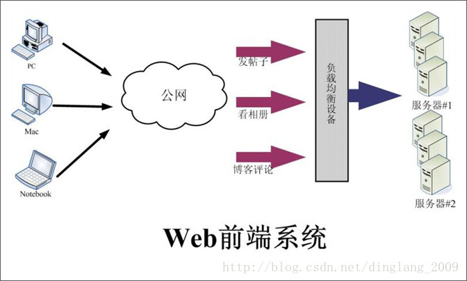
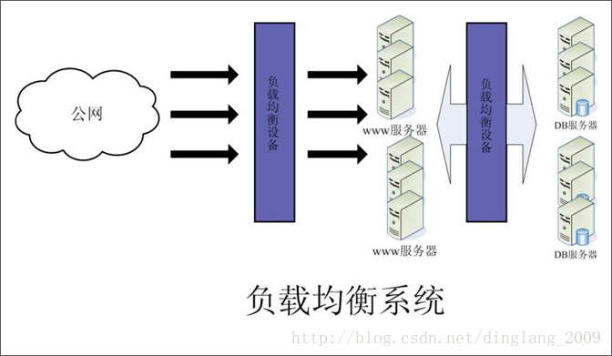
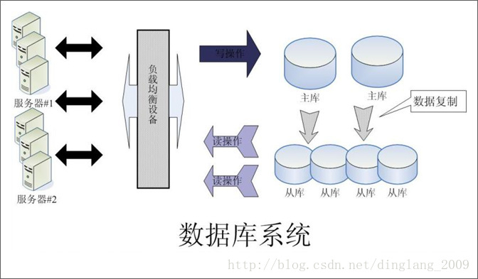
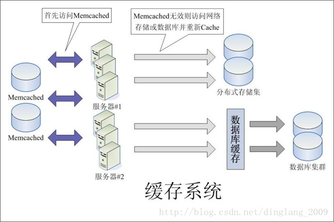
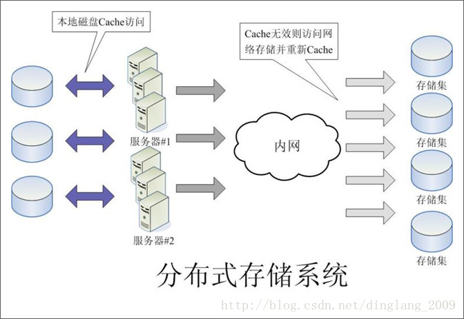

大型动态应用系统平台主要是针对于大流量、高并发网站建立的底层系统架构。大型网站的运行需要一个可靠、安全、可扩展、易维护的应用系统平台做为支撑，以保证网站应用的平稳运行。

大型动态应用系统又可分为几个子系统：

1. **Web前端系统**
2. **负载均衡系统**
3. **数据库集群系统**
4. **缓存系统**
5. **分布式存储系统**

### Web前端系统

结构图：

为了达到不同应用的服务器共享、避免单点故障、集中管理、统一配置等目的，不以应用划分服务器，而是将所有服务器做统一使用，每台服务器都可以对多个应用提供服务，当某些应用访问量升高时，通过增加服务器节点达到整个服务器集群的性能提高，同时使他应用也会受益。该Web前端系统基于Apache/Lighttpd/Eginx等的虚拟主机平台，提供PHP程序运行环境。服务器对开发人员是透明的，不需要开发人员介入服务器管理

### 负载均衡系统

结构图：

负载均衡系统分为硬件和软件两种。硬件负载均衡效率高，但是价格贵，比如F5等。软件负载均衡系统价格较低或者免费，效率较硬件负载均衡系统低，不过对于流量一般或稍大些网站来讲也足够使用，比如lvs, nginx。大多数网站都是硬件、软件负载均衡系统并用。

### 数据库集群系统

结构图：

由于Web前端采用了负载均衡集群结构提高了服务的有效性和扩展性，因此数据库必须也是高可靠的，才能保证整个服务体系的高可靠性，如何构建一个高可靠的、可以提供大规模并发处理的数据库体系？

我们可以采用如上图所示的方案：

1. 使用 MySQL 数据库，考虑到Web应用的数据库读多写少的特点，我们主要对读数据库做了优化，提供专用的读数据库和写数据库，在应用程序中实现读操作和写操作分别访问不同的数据库。
2. 使用 MySQL Replication 机制实现快速将主库（写库）的数据库复制到从库（读库）。一个主库对应多个从库，主库数据实时同步到从库。
3. 写数据库有多台，每台都可以提供多个应用共同使用，这样可以解决写库的性能瓶颈问题和单点故障问题。
4. 读数据库有多台，通过负载均衡设备实现负载均衡，从而达到读数据库的高性能、高可靠和高可扩展性。
5. 数据库服务器和应用服务器分离。
6. 从数据库使用BigIP做负载均衡。

### 缓存系统

结构图：

缓存分为文件缓存、内存缓存、数据库缓存。在大型Web应用中使用最多且效率最高的是内存缓存。最常用的内存缓存工具是Memcached。使用正确的缓存系统可以达到实现以下目标：

1. 使用缓存系统可以提高访问效率，提高服务器吞吐能力，改善用户体验。
2. 减轻对数据库及存储集服务器的访问压力。
3. Memcached服务器有多台，避免单点故障，提供高可靠性和可扩展性，提高性能。

### 分布式存储系统

结构图：

Web系统平台中的存储需求有下面两个特点：

1. 存储量很大，经常会达到单台服务器无法提供的规模，比如相册、视频等应用。因此需要专业的大规模存储系统。
2. 负载均衡cluster中的每个节点都有可能访问任何一个数据对象，每个节点对数据的处理也能被其他节点共享，因此这些节点要操作的数据从逻辑上看只能是一个整体，不是各自独立的数据资源。
　　
因此高性能的分布式存储系统对于大型网站应用来说是非常重要的一环。

